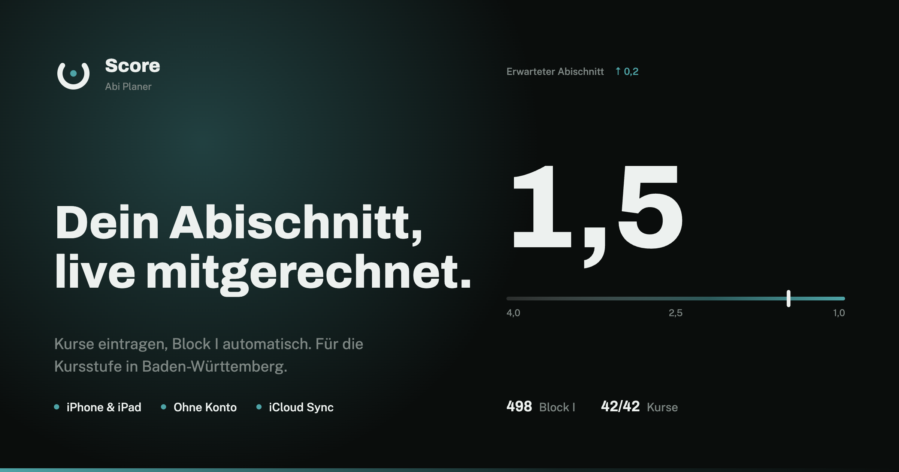
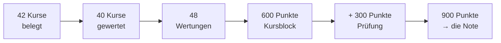

<div align="center">


# Score

**Der Abi-Planer für Baden-Württemberg.**
Kurse eintragen, Block I und Prüfungsblock live mitgerechnet — ohne Konto, ohne Server.

[](https://score.levo-studio.com)
[](https://github.com/levo-studio/score)
[](#lizenz)
[](https://nextjs.org)
[](https://www.typescriptlang.org)

<br />



</div>

<br />

## Inhalt

- [Was das hier ist](#was-das-hier-ist)
- [Wie Baden-Württemberg rechnet](#wie-baden-württemberg-rechnet)
- [Stack](#stack)
- [Lokal entwickeln](#lokal-entwickeln)
- [Projektstruktur](#projektstruktur)
- [Deployment](#deployment)
- [Datenschutz](#datenschutz)
- [Lizenz](#lizenz)

<br />

## Was das hier ist

Dies ist die Marketing-Website zu **Score**, einer iOS- und iPadOS-App, die
Schüler:innen der gymnasialen Oberstufe in Baden-Württemberg durch die
Kursstufe begleitet. Score trägt Noten ein, rechnet Block I und den
Prüfungsblock nach der amtlichen Formel und zeigt jederzeit den erwarteten
Abischnitt.

Kein Konto, kein Backend. Alle Daten liegen in der privaten iCloud der
Nutzer:in und gleichen sich zwischen iPhone und iPad ab. Gespeicherte Felder
sind verschlüsselt — Apple sieht die Struktur der Daten, nicht ihre Werte.

Die App selbst liegt in einem eigenen Repository: **[levo-studio/score](https://github.com/levo-studio/score)**.

<br />

## Wie Baden-Württemberg rechnet

Die Website erklärt die amtliche Rechnung, nicht eine vereinfachte Version
davon. Kurz zusammengefasst:



**Kursblock (0–600 Punkte).** Belegt werden mindestens 42 Kurse — zwölf in
den drei Leistungsfächern, mindestens dreißig weitere. Eingebracht werden 40:
wer mehr hat, klammert erst selbst, dann sortiert die App die schwächsten
Kurse von unten heraus. Nur die Kurse der fünf Prüfungsfächer sind gesetzt.
Zwei der drei Leistungsfächer zählen doppelt, aus 40 Kursen werden also 48
Wertungen. Die Punktzahl ist die Summe aller Wertungen, geteilt durch 48, mal
40 — mindestens 200 Punkte zum Bestehen.

**Prüfungsblock (0–300 Punkte).** Fünf Abiturprüfungen — drei schriftliche in
den Leistungsfächern, zwei mündliche — zählen jeweils vierfach. Mindestens
100 Punkte zum Bestehen.

**Note.** Kursblock und Prüfungsblock ergeben 300 bis 900 Punkte. Die Note
kommt aus der amtlichen Tabelle des Kultusministeriums in Schritten von 18
Punkten — nicht aus einer Formel.

<br />

## Stack

| Bereich | Wahl |
| --- | --- |
| Framework | [Next.js 16](https://nextjs.org) (App Router) |
| Sprache | TypeScript, strict |
| Styling | [Tailwind CSS 4](https://tailwindcss.com) |
| Animation | [GSAP](https://gsap.com) + ScrollTrigger |
| Paketmanager | [pnpm](https://pnpm.io) |
| Hosting | Self-hosted via [Dokploy](https://dokploy.com) + Traefik |
| Registry | GitHub Container Registry (GHCR) |
| CI/CD | GitHub Actions |

<br />

## Lokal entwickeln

Voraussetzungen: Node.js 22, [pnpm](https://pnpm.io).

```bash
pnpm install
pnpm dev
```

Die Seite läuft danach unter `http://localhost:6239`.

```bash
pnpm build   # Produktions-Build
pnpm lint    # ESLint
pnpm start   # Produktions-Build lokal starten
```

<br />

## Projektstruktur

```
src/
├── app/                  Next.js App Router — Seiten, Metadaten, Health-Route
│   ├── datenschutz/
│   ├── impressum/
│   └── api/health/
├── components/
│   ├── sections/         Die Abschnitte der Startseite, in Reihenfolge
│   └── motion/           GSAP-Bausteine: Reveal, MaskLines, Stagger, Bars
└── lib/                  Konstanten, Theme-Hook, geteilte Klassen
```

Externe Verweise (App-Store-Link, GitHub-URLs) stehen gesammelt in
[`src/lib/constants.ts`](src/lib/constants.ts) — nirgendwo sonst im Code.

<br />

## Deployment

Jeder Push auf `main` baut über [`.github/workflows/deploy.yml`](.github/workflows/deploy.yml)
ein Docker-Image nach [`Dockerfile.dokploy`](Dockerfile.dokploy), verifiziert
es auf GHCR und löst danach das Deployment auf der Levo-Studio-Infrastruktur
aus. Kein Schritt überspringt den vorherigen — ein fehlgeschlagener Build
löst kein Deployment aus.

<br />

## Datenschutz

Diese Website selbst setzt kein Tracking, keine Cookies und keinen
Consent-Banner ein. Details dazu und zur App stehen unter
[/datenschutz](https://score.levo-studio.com/datenschutz).

<br />

## Lizenz

Der Quellcode ist einsehbar, aber nicht Open Source: private Nutzung ist
erlaubt, kommerzielle Nutzung und abgeleitete Werke sind es nicht.

<br />

<div align="center">

Ein Produkt von **[Levo Studio](https://github.com/levo-studio)** · © 2026

</div>
